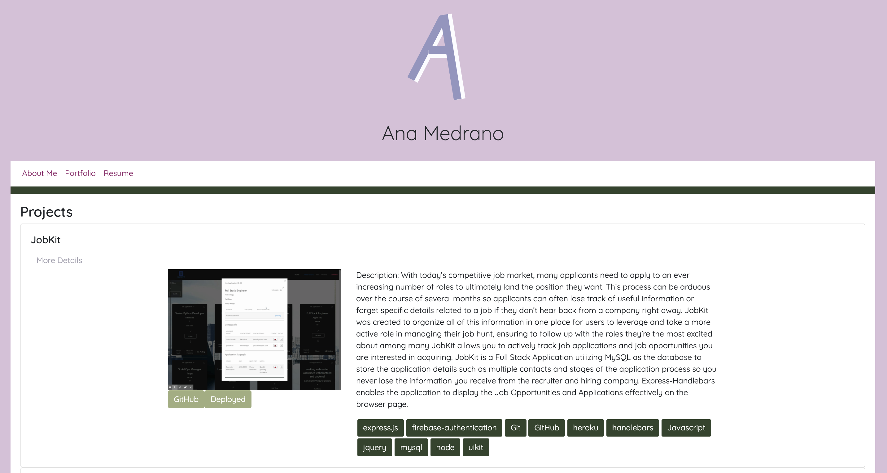

# React Portfolio Read Me
        
## Summary

With react, I was able to take the previous iteration of my portfolio and create a much more beautiful and dynamic application. This website has an introduction page that uses animations, an about me page, portfolio and resume.

## Site Picture




## Table of Contents

- [Technologies Used](#Technologies-Used)
- [Learning Points](#Learning-Points)
- [Use](#Use)
- [Installation](#Installation)
- [Code Snippets](#Code-Snippets)
- [Usage](#Usage)
- [Author](#Author)

## Technologies Used
- sequelize - used to store and retrieve data
- Javascript / Node - used to build an interactive and dynamic app
- Bootstrap - used to create a clean looking website
- Git - version control system for tracking changes to code
- Github - to host the repository
- Heroku - to host the deployed site

## Learning Points
- How to essentially build just a front end up given that the back end had been build by me before
- There was so much troubleshooting happening when routes failed or 404 issues arose
- I discovered animations this week and wanted to take the opportunity to practice using them

## Dependencies
```
express
express-handlebars
axios
if-env
mysql2
path
sequelize
concurrently
nodemon
```

## Usage
- For finding job opportunities. Click around and enjoy the content otherwise create your own either using the front end of the back end.

## Code Snippet
One challenge in the last version of this project was that conditional formatting was essentially impossible. This time, since I was using React, I had the opportunity to take advantage of conditional rendering in the portfolio page where I wanted to omit buttons if the information did not exist.

```
{props.data.githubRep.length > 0 ?
<a style={{backgroundColor: "#a0ae7e", border: "none"}}type="button" href={props.data.githubRep} target="_blank" className="btn btn-primary">GitHub</a> : null}
```

## Author
[GitHub](https://github.com/analoo)

